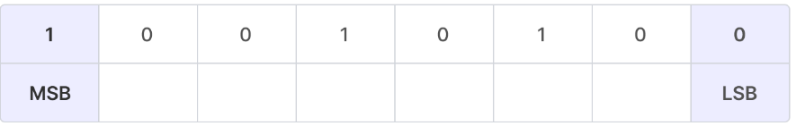

# MSB & LSB

- MSB: Most Significant Bit
- LSB: Least Significant Bit

# MSB & LSB for signed integers

- For signed integers, the MSB is the sign bit.
- MSB = 1 (negative number) or MSB = 0 (positive number)
